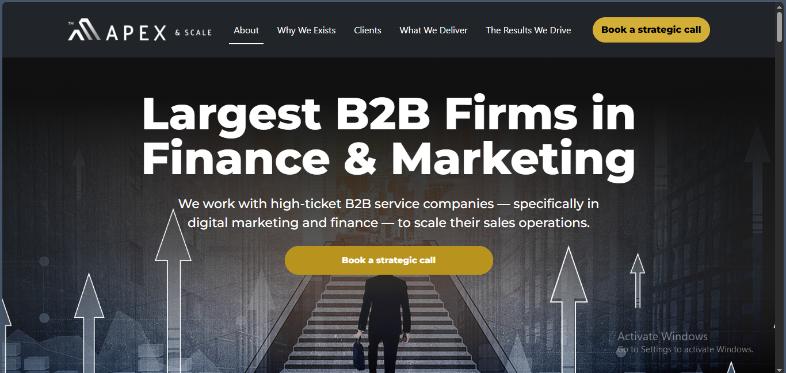

<div align="center">

# 🚀 Apex & Scale – B2B Business Consultant Landing Page

### Responsive B2B Business Consulting Landing Page

A premium, responsive corporate landing page designed for **Finance** and **Digital Marketing** consulting firms.

<p align="center">

</p>


</div>

---

# 📖 About

Apex & Scale is a modern business landing page created for agencies that help high-ticket B2B companies grow through strategic consulting and scalable sales systems.

The project focuses on clean UI, responsive layouts, modern business design, and conversion-focused sections that deliver an engaging user experience.

---

# ✨ Features

- Modern Corporate UI
- Fully Responsive Design
- Bootstrap 5 Grid System
- Sticky Navigation
- Animated Hover Effects
- Smooth Scrolling Navigation
- Scroll-To-Top Button
- Call-To-Action Sections
- Font Awesome Icons
- Cross Browser Compatible
- Mobile Friendly
- Clean & Maintainable Code

---

# 🛠️ Built With

- HTML5
- CSS3
- Bootstrap 5
- JavaScript (ES6)
- jQuery
- Font Awesome

---

# 📂 Project Structure

```
apex-b2b-business-consultant/
│
├── css/
│   └── style.css
│
├── images/
│
├── js/
│   └── script.js
│
├── index.html
│
└── README.md
```

---

# 📸 Preview

## Desktop Version

<p align="center">

</p>

---

# 💼 Perfect For

- Business Consulting
- Marketing Agencies
- Financial Firms
- SaaS Companies
- Startup Landing Pages
- Corporate Websites

---

# 🚀 Getting Started

Clone the repository

```bash
git clone https://github.com/rihankabir/apex-b2b-business-consultant.git
```

Go to the project directory

```bash
cd apex-b2b-business-consultant
```

Open **index.html** in your browser.

---

# 📱 Responsive

Optimized for

- Desktop
- Laptop
- Tablet
- Mobile

---

# 📬 Connect With Me

🌐 **Portfolio**  
https://rihankabir.com/

💼 **LinkedIn**  
https://www.linkedin.com/in/rihankabir/

💻 **GitHub**  
https://github.com/rihankabir

---

# 👨‍💻 Author

## Md. Rihanul Kabir

Frontend Developer | WordPress Developer | PHP Developer

I'm passionate about building responsive, user-friendly, and modern websites using HTML, CSS, Bootstrap, JavaScript, jQuery, PHP, MySQL, and WordPress.

---

<div align="center">

### ⭐ If you found this project useful, please consider giving it a Star!

Made with ❤️ by **Md. Rihanul Kabir**

</div>
